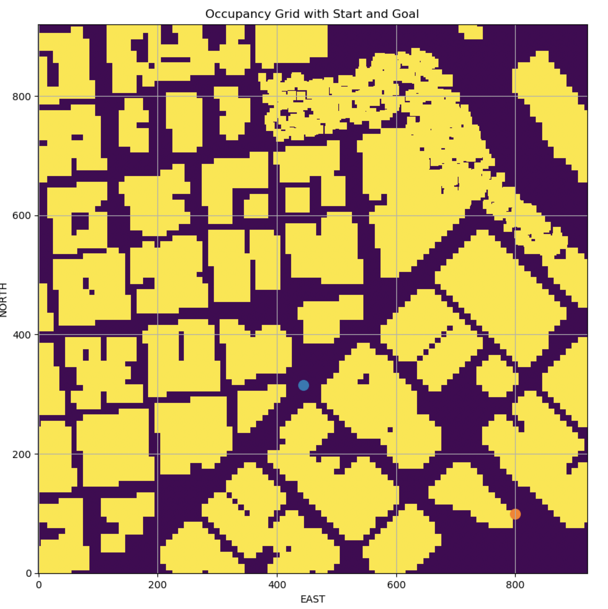

## Project: 3D Motion Planning


---


# Required Steps for a Passing Submission:
1. Load the 2.5D map in the colliders.csv file describing the environment.
2. Discretize the environment into a grid or graph representation.
3. Define the start and goal locations.
4. Perform a search using A* or other search algorithm.
5. Use a collinearity test or ray tracing method (like Bresenham) to remove unnecessary waypoints.
6. Return waypoints in local ECEF coordinates (format for `self.all_waypoints` is [N, E, altitude, heading], where the drone’s start location corresponds to [0, 0, 0, 0].
7. Write it up.
8. Congratulations!  Your Done!

## [Rubric](https://review.udacity.com/#!/rubrics/1534/view) Points
### Here I will consider the rubric points individually and describe how I addressed each point in my implementation.  

---
Below I describe how I addressed each rubric point and where in my code each point is handled.

### Explain the Starter Code

#### 1. Explain the functionality of what's provided in `motion_planning.py` and `planning_utils.py`
I completed the TODO portions in the two main python files motion_planning.py and planning_utils.py that is needed to complete this project. I generated a arbitary goal position in LLA coordinates and converted the goal and start positions to NED coordinates. I then converted these positions to start and goal grid points. I was then able to use the A* algorithm to plan a path to the goal. After the grid path is computed, I pruned the path to waypoints using the ray tracing collision check method. Once the waypoints are obtained I used them to fly the drone in the simulator from its start to the goal.

And here's a screenshot of the drone following the planned path through the waypoints from the start to the goal in the environment.


### Implementing Your Path Planning Algorithm

#### 1. Set your global home position
The code below shows the read_global_home function which reads the first line that has the lattitude and longitude of the home position. This function is used in the main set the drones home position using the self.set_home_position().

```python
def read_global_home(fname):
    import re
    first_line = open(fname).readline()
    print(first_line)
    coord = re.match(r'^lat0 (.*), lon0 (.*)$', first_line)
    if coord:
        lat = coord.group(1)
        lon = coord.group(2)
    return float(lat), float(lon)

obstacle_file = 'colliders.csv'
# TODO: read lat0, lon0 from colliders into floating point values
lat0, lon0 = read_global_home(obstacle_file)

# TODO: set home position to (lon0, lat0, 0)
print('Set global home position from file ', lon0, lat0)
self.set_home_position(lon0, lat0, 0.0)

```


And here is a lovely picture of our downtown San Francisco environment from above!


#### 2. Set your current local position
Here as long as you successfully determine your local position relative to global home you'll be all set. Explain briefly how you accomplished this in your code.

The code below reads the self.global_position of the drone and also the global home position previously obtained in self.global_home in LLA coordinates. It then feeds the two to the udacidrone.frame_utils.global_to_local function that computes the relative displacement of the drone with respect to the home in NED coordinates.

```python
# TODO: convert to current local position using global_to_local()
local_home_NED = global_to_local(self.global_position, self.global_home)
print('local_home NED ', local_home_NED)
print('global home {0}, position {1}, local position {2}'.format(self.global_home, self.global_position, self.local_position))
```

Once the drones local position is obtained in NED coordinates, the drone environment with all the obstacles is read into the data as shown below. This data is then used to create a 2D grid with 1m grid resolution using the create_grid function in planning_utils.py. This function returns the grid and the north_offset and east_offset which are needed to convert positions in NED coordinates to the grid coordinates.

```python
# Read in obstacle map
data = np.loadtxt(obstacle_file, delimiter=',', dtype='Float64', skiprows=2)
    
# Define a grid for a particular altitude and safety margin around obstacles
grid, north_offset, east_offset = create_grid(data, TARGET_ALTITUDE, SAFETY_DISTANCE)
print("North offset = {0}, East offset = {1}".format(north_offset, east_offset))
```

The resulting grid (1000x1000) with the yellow indicating occupied cells and brown indicating free cells is shown below. Blue dot indicates the start cell and the red dot indicates the goal cell.



#### 3. Set grid start position from local position

This code snippet shows the conversion of the drone start point from LLA to  NED coordinates. This local_home_NED is then converted to the grid_start cell in the grid coordinates using the north_offset and east_offset.

```python
# TODO: convert to current local position using global_to_local()
local_home_NED = global_to_local(self.global_position, self.global_home)

# Define starting point on the grid (this is just grid center)
# TODO: convert start position to current position rather than map center
grid_start = (int(-north_offset + local_home_NED[0]), int(-east_offset + local_home_NED[1]))
```

#### 4. Set grid goal position from geodetic coords
The code below shows how an arbitary goal point in LLA coordinates is set and then first converted to the local NED coordinates. Then the local_goal is then converted to the grid_goal in grid coordinates.

```python
# Set goal as some arbitrary position on the grid
# TODO: adapt to set goal as latitude / longitude position and convert
goal_lat_lon_alt = (-122.39343735,   37.79051296,    TARGET_ALTITUDE)
 
local_goal = global_to_local(goal_lat_lon_alt, self.global_home)

grid_goal = (int(-north_offset + local_goal[0]), int(-east_offset + local_goal[1]))

```

#### 5. Modify A* to include diagonal motion (or replace A* altogether)
In order to search the grid more completely, the Action class was modified as shown below to add four additional diagonal moves in additional to the existing four standard cardinal directions. 

In addition the valid_action function was changed to incorporate the additional four actions as shown below. 

```python
class Action(Enum):
    """
    An action is represented by a 3 element tuple.
    
    The first 2 values are the delta of the action relative
    to the current grid position. The third and final value
    is the cost of performing the action.
    """
    
    WEST =      ( 0, -1, 1)
    EAST =      ( 0,  1, 1)
    NORTH =     (-1,  0, 1)
    SOUTH =     ( 1,  0, 1)
    SOUTHWEST = ( 1, -1, 1.414)
    SOUTHEAST = ( 1,  1, 1.414)
    NORTHWEST = (-1, -1, 1.414)
    NORTHEAST = (-1,  1, 1.414)

    @property
    def cost(self):
        return self.value[2]

    @property
    def delta(self):
        return (self.value[0], self.value[1])

def valid_actions(grid, current_node):
  """
    Returns a list of valid actions given a grid and current node.
    """
  valid_actions = list(Action)
  n, m = grid.shape[0] - 1, grid.shape[1] - 1
  x, y = current_node# check if the node is off the grid or
  # it's an obstacle

  if x - 1 < 0 or grid[x - 1, y] == 1:
    valid_actions.remove(Action.NORTH)
  if x + 1 > n or grid[x + 1, y] == 1:
    valid_actions.remove(Action.SOUTH)
  if y - 1 < 0 or grid[x, y - 1] == 1:
    valid_actions.remove(Action.WEST)
  if y + 1 > m or grid[x, y + 1] == 1:
    valid_actions.remove(Action.EAST)
  if x - 1 < 0 or y - 1 < 0 or grid[x - 1, y - 1] == 1:
    valid_actions.remove(Action.NORTHWEST)
  if x - 1 < 0 or y + 1 > n or grid[x - 1, y + 1] == 1:
    valid_actions.remove(Action.NORTHEAST)
  if x + 1 > n or y - 1 < 0 or grid[x + 1, y - 1] == 1:
    valid_actions.remove(Action.SOUTHWEST)
  if x + 1 > n or y + 1 > n or grid[x + 1, y + 1] == 1:
    valid_actions.remove(Action.SOUTHEAST)

  return valid_actions

def heuristic(position, goal_position):
    return np.hypot(position[0] - goal_position[0], position[1] - goal_position[1])
```

The modified a_start search function was used to compute the path between the local_home and the local_goal positions. The result is the path shown in red in the figures in the following section.

#### 6. Cull waypoints 

The raw set of path points obtained from a_star is a set of connected cells from the start cell to the goal cell. These path points will number in the hundreds and are too close for a drone to follow dynamically. These path points need to be pruned such that only the start, end and important waypoints are included.

##### Prune using Collinearity

The path can be pruned into a significantly smaller set of waypoints using collinearity tests on the points.  The prune_path_collinear function takes the path and a tolerance value to eliminate all points which are collinear with a epsilon of 1.0m. The result is shown below.

```python
def prune_path_collinear(path, epsilon=1e-6):

  def point(p):
    return np.array([p[0], p[1], 1.]).reshape(1, -1)

  def collinearity_check(p1, p2, p3):   
    m = np.concatenate((p1, p2, p3), 0)
    det = np.linalg.det(m)
    return abs(det) < epsilon

  pruned_path = [p for p in path]
  i = 0
  while i < len(pruned_path) - 2:
    p1 = point(pruned_path[i])
    p2 = point(pruned_path[i+1])
    p3 = point(pruned_path[i+2])
    collinear = collinearity_check(p1, p2, p3)
    if collinear:
      pruned_path.remove(pruned_path[i+1])
    else:
      i += 1
      return pruned_path	
```


##### Prune using RayTracing

I implemented another pruning function using ray tracing using the Bresenham algorithm on the same path points. The result was a significant reduction in waypoints from the previous prune_path_collinearity function. The prune_path_bresenham is shown below and the resulting path with green waypoints is shown below.

```python
def prune_path_bresenham(grid, path):
  no_coll_p = path[0]
  pruned_path = [no_coll_p]
  for p in path[1:]:
    p1 = pruned_path[-1]
    cells = list(bresenham(int(p1[0]), int(p1[1]), 
                           int(p[0]), int(p[1])))
    collide = False
    for c in cells:
      if grid[c[0], c[1]] == 1:
        collide = True

        if not collide:
          no_coll_p = p
        else:
          pruned_path.append((int(no_coll_p[0]), int(no_coll_p[1])))

    # Append last path point
    p_last = path[-1]
    pp_last = pruned_path[-1]
    if (np.hypot(p_last[0]-pp_last[0], p_last[1]-pp_last[1]) < 1.0):
      pruned_path.append((int(p_last[0]), int(p_last[1])))

    return pruned_path
```


The pruned path points still lack the direction which are needed as the yaw angle for each waypoint. I used the atan2 function to compute the desired yaw angle for each waypoint from its previous one as shown below.

```python
# Convert path to waypoints
waypoints = [[p[0] + north_offset, p[1] + east_offset, TARGET_ALTITUDE, 0] for p in pruned_path]
ow = waypoints[0]
ang_waypoints = []
ang_waypoints.append(ow)
for i, w in enumerate(waypoints):
  if(i > 0):
    ang = math.atan2(w[0]-ow[0], w[1]-ow[1])
    ang_waypoints.append([w[0], w[1], w[2], ang])
    ow = w

    print('Waypoints ', ang_waypoints)
    # Set self.waypoints
    self.waypoints = ang_waypoints
```

### Execute the flight

#### 1. Does it work?
The movie of the drone tracking the computed path through the waypoints is shown below.

<video controls width="600">
  <source src="Docs/astar_diag_raytrace_v0.1.0.mp4" type="video/quicktime">
  Your browser does not support the video tag.
</video>

#### 

### Double check that you've met specifications for each of the [rubric](https://review.udacity.com/#!/rubrics/1534/view) points.

# Extra Challenges: Real World Planning

For an extra challenge, consider implementing some of the techniques described in the "Real World Planning" lesson. You could try implementing a vehicle model to take dynamic constraints into account, or implement a replanning method to invoke if you get off course or encounter unexpected obstacles.

